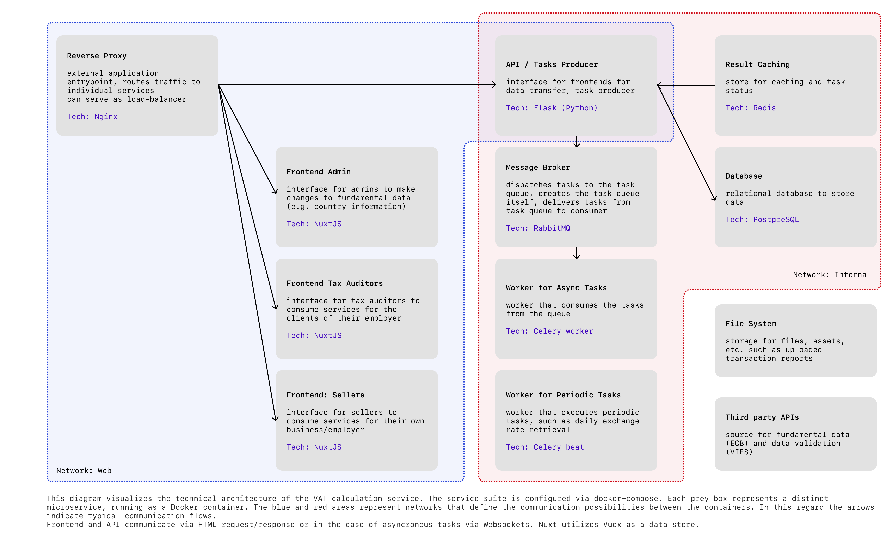

# Tax-Automation

<!-- PROJECT LOGO -->
<br />
<p align="center">
    

  <h3 align="center">Tax Automation</h3>

  <p align="center">
    Automated VAT calculations for Amazon Sellers
    <br />
    <a href="https://github.com/TM312/vat_automation/issues"><strong>Report Bug/Request feature »</strong></a>
  </p>
</p>


<!-- TABLE OF CONTENTS -->
<details open="open">
  <summary>Table of Contents</summary>
  <ol>
    <li>
      <a href="#about">About</a>
    </li>
    <li><a href="#development-architecture">Development Architecture</a></li>
    <li><a href="#local-deployment">Local Deployment</a></li>
    <li><a href="#screen-preview">Screen Preview</a></li>
  </ol>
</details>


## About
This is the main repo of a VAT calculation application for Amazon sellers. This was a project I worked on for a major part of 2020 in collaboration with an Amazon seller and multiple tax auditing companies.

## Development Architecture

<ol>
    <li><a href="#design-schema">Design Schema</a></li>
    <li><a href="##tree-high-level">Tree High Level</a></li>
    <li><a href="#tree-low-level">Tree Low Level</a></li>
</ol>

### Design Schema


### Tree High Level

The directory structure below aligns closely to the design schema outlined above. 
```
.
├── README.md                   # This file
├── api                         # Corresponds to API / Tasks Producer. 
|                               # Furthermore, tasks for the Celery workers 
|                               # and route decorators for Redis based result caching are being defined. 
├── assets                      # Store for images in this README
├── db                          # Corresponds to API / Tasks Producer
├── Makefile                    # Command overview
├── docker-compose.dev.yml      # Docker-compose overwrite file for the DEV environment
├── docker-compose.prod.yml     # Docker-compose overwrite file for the PROD environment
├── docker-compose.stage.yml    # Docker-compose overwrite file for the STAGE environment
├── docker-compose.test.yml     # Docker-compose overwrite file for the TEST environment
├── docker-compose.yml          # Docker-compose main file
├── front                       # Corresponds to Frontend Sellers
├── front_admin                 # Corresponds to Frontend Admin; not fully sketched out.
├── front_tax                   # Corresponds to Frontend Tax Auditors
├── init-letsencrypt.sh         # Script to get letsencrypt certificates for domains
├── nginx                       # Corresponds to Reverse Proxy
└── redis                       # Corresponds to Result caching.
```

#### Comments on selected services
- API: [Flask](https://flask.palletsprojects.com/en/2.0.x/) is being used as the underlying micro-framework with the following extensions:
    - [flask_restx](https://flask-restx.readthedocs.io/en/latest/): support for quick REST APIs
    - [flask_session](https://flask-session.readthedocs.io/en/latest/): support for Server-side Session
    - [flask_sqlalchemy](https://flask-sqlalchemy.palletsprojects.com/en/2.x/): support for SQLAlchemy
    - [flask_migrate](https://flask-migrate.readthedocs.io/en/latest/): support for SQLAlchemy database migrations
    - [flask_bcrypt](https://flask-bcrypt.readthedocs.io/en/latest/): provides bcrypt hashing utilities
    - [flask_cors](https://flask-cors.readthedocs.io/en/latest/): handling Cross Origin Resource Sharing (CORS)
    - [flask_caching](https://flask-caching.readthedocs.io/en/latest/): caching support
    - [flask_mail](https://pythonhosted.org/Flask-Mail/): set up SMTP
    - [flask_limiter](https://flask-limiter.readthedocs.io/en/stable/): provides rate limiting features
    - [flask_socketio](https://flask-socketio.readthedocs.io/en/latest/): provides support for websockets

    - others:
      - [FlaskDynaconf](https://dynaconf.readthedocs.io/en/docs_223/guides/flask.html), to allow for dot-notation of config variables
      - [gevent](http://www.gevent.org/)
      - [gunicorn](https://gunicorn.org/)

- DB: Postgres
- Front*: [NuxtJS](https://nuxtjs.org/) is the underlying framework. Here, [Vuex](https://v3.vuex.vuejs.org/#what-is-a-state-management-pattern) is used to handle state. The following modules are integrated:
  - [nuxtjs/axios](https://axios.nuxtjs.org/) to make axios-based requests to the api
  - [nuxtjs/auth](https://auth.nuxtjs.org/) to support authentication handling on the frontend
  - [nuxt-socket-io](https://github.com/richardeschloss/nuxt-socket-io) to provide websocket support for the frontend


### Tree Low Level

Below is the same structure as above but including lower directory levels.

```
.
├── README.md
├── api
│   ├── Dockerfile
│   ├── README.md
│   ├── app
│   │   ├── __init__.py
│   │   ├── __init___test.py
│   │   ├── config.py                       # Specification of global variables used inside the app. 
│   │   |                                   # Sensitive information is provided via env variables.
│   │   ├── extensions                      # Flask extensions are initiated here
│   │   ├── logs                            # Logging setup
│   │   ├── namespaces                      # Namespaces are structured analogously 
│   │   │   ├── account                     
│   │   │   │   ├── __init__.py
│   │   │   │   ├── controller.py           # API routes incl. decorators
│   │   │   │   ├── interface.py            # Type definition
│   │   │   │   ├── model.py                # Database model definition incl. creation, update, etc. methods
│   │   │   │   ├── schema.py               # (De-)Serialisation schema
│   │   │   │   └── service.py              # Definition of business logic triggered by API calls or other services
│   │   │   ├── auth
│   │   │   ├── bundle
│   │   │   ├── business
│   │   │   ├── category
│   │   │   ├── channel
│   │   │   ├── country
│   │   │   ├── currency
│   │   │   ├── distance_sale
│   │   │   ├── email
│   │   │   ├── exchange_rate
│   │   │   ├── item
│   │   │   ├── item_tag
│   │   │   ├── platform
│   │   │   ├── tag
│   │   │   ├── tax
│   │   │   ├── tax_record
│   │   │   ├── transaction                 # Tax relevant transactions
│   │   │   ├── transaction_input           # Transactions as provided by Amazon
│   │   │   ├── transaction_type
│   │   │   ├── transaction_type_public     # Transaction type mapping to handle platform specific transaction type codes. 
|   |   |   |                               # This mapping allows the solution to be extended to additional platforms such as Shopify
│   │   │   ├── user
│   │   │   └── utils
│   │   ├── routes.py                       # Attaching the namespaces to the app
│   │   ├── tasks                           # Definition of asynchronous and periodic tasks being executed by Celery workers 
│   │   ├── templates                       # (Jinja2)-templates used for customer correspondence
│   │   └── test                            # Basic test setup
│   ├── commands                            # Sample/initial data and command definition to seed the database
│   │   ├── __init__.py
│   │   ├── seed_command.py
│   │   └── seeds
│   ├── data
│   │   ├── audit_files                     # Notes from a feedback session
│   │   ├── templates                       # Templates for ideal input required from sellers. App can handle missing information.
│   │   └── test                            # Test data used for demos
│   ├── manage.py                           # Command definition to seed, create or drop database
│   ├── requirements.txt                    # API dependency definition
│   ├── seeds                               # Seed data, mostly static.
│   │   ├── countries.csv
│   │   ├── countries_full.csv
│   │   ├── eu.csv
│   │   ├── hist_exchange_rates.csv         # Should be downloaded new from ECB before seeding db
│   │   ├── sample_seller_firm
│   │   ├── tax_codes.csv
│   │   ├── tax_rate_types.csv
│   │   ├── vat.csv
│   │   └── vat_covid19.csv
│   ├── wait-for-it.sh
│   └── wsgi.py                             # App entrypoint
├── assets
├── db
│   └── Dockerfile
├── docker-compose.dev.yml
├── docker-compose.prod.yml
├── docker-compose.stage.yml
├── docker-compose.test.yml
├── docker-compose.yml
├── front                                   # Architecture follows the default Nuxt2 directory structure
│   ├── Dockerfile
│   ├── Dockerfile.dev
│   ├── README.md
│   ├── assets
│   ├── components
│   ├── jsconfig.json
│   ├── layouts
│   ├── middleware
│   ├── nuxt.config.js
│   ├── package-lock.json
│   ├── package.json
│   ├── pages
│   ├── plugins
│   ├── repositories
│   │   ├── AccountRepository.js
│   │   ├── ...
│   │   ├── Repository.js
│   ├── static
│   └── store                               # Vuex store corresponds largely with API namespace design.
│       ├── account.js
│       ├── ...
├── front_admin
│   ├── ...                                 # Structured analogously to front
├── front_tax
│   ├── ...                                 # Structured analogously to front
├── init-letsencrypt.sh
├── nginx                                   # Docker file and service config, here env specific
│   ├── Dockerfile
│   ├── dev
│   │   ├── cors-settings.conf
│   │   └── main.conf
│   ├── docker-compose.prod.yml
│   ├── nginx.conf
│   └── prod
│       └── main.conf
└── redis                                   # Docker file and service config
    ├── Dockerfile
    └── redis.conf
```

## Local Deployment

### Requirements
- Docker
- docker-compose

### Commands

1. Provide the variables defined inside `env.template` and `dev.env.template`
2. Rename `env.template` to `.env` and `dev.env.template` to `.dev.env`
3. Install the deps in the front* containers via `cd front && npm install`, etc.
4. The Makefile contains the commands to start the containers and seed the db. For instance run `make run-dev-local` to run the app locally. The db needs to be seeded in order for the app to work since it static data such as exchange rates and currencies information are needed.


## Screen Preview

<ol>
    <li><a href="#landing-page">Landing Page</a></li>
    <li><a href="##interface-sellers">Interface Sellers</a></li>
    <li><a href="#interface-tax-auditors">Interface Tax Auditors</a></li>
</ol>

### Landing Page
I used product screens for a sample company for the landing page 

https://user-images.githubusercontent.com/47108756/226808900-d81ce195-449b-4d7b-93d7-918c156a4768.mp4


### Product Page
For this sample company I created all documents Amazon sellers typically submit to Amazon and tax auditors, such as an item overview an transaction sheets. This was then used to calculate the vat for each transaction and the corresponding tax reports. In the demo users could select arbitrary reporting periods and countries, which has a direct effect on the tax report. So this was actually live calculated, but once a combination had been requested once it was added to the database and from then on would be returned without further processing for later visitors.  

https://user-images.githubusercontent.com/47108756/226807974-b104262d-51d3-48ab-a7c8-586c54171ea0.mp4


### Interface Tax Auditors
Tax auditors in larger firms are typically responsible for a portfolio of clients which was considered by allowing them to follow specific clients and view but also calculate tax reports on their behalf.

https://user-images.githubusercontent.com/47108756/226809641-e8c0d8fe-ef5f-486d-9ddb-01ae773d21c8.mp4
